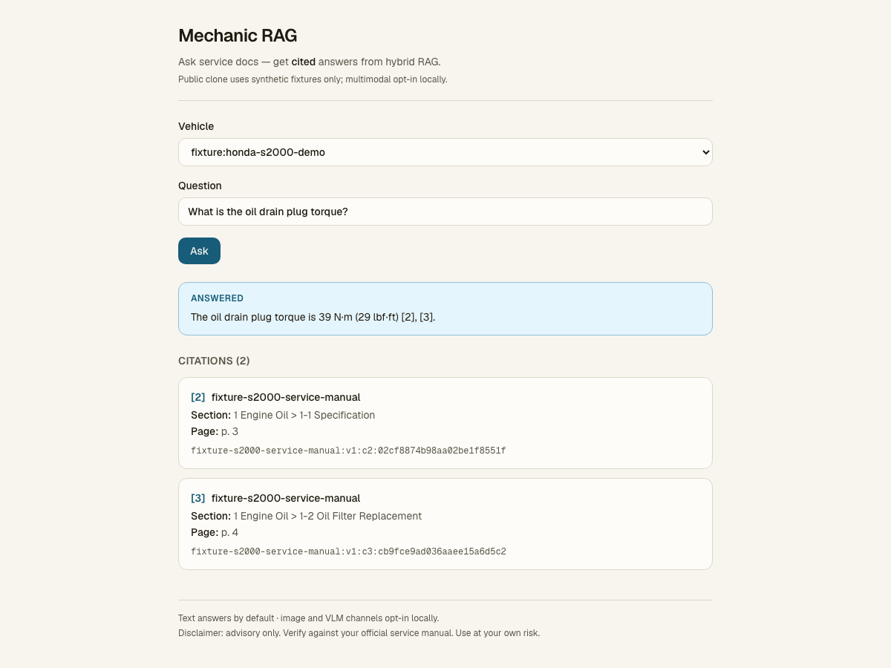
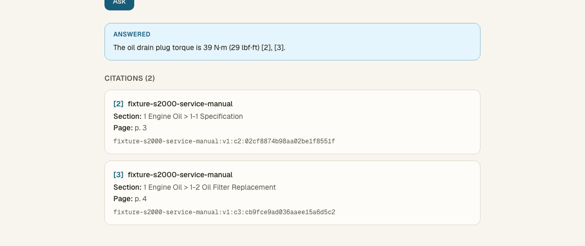

# Mechanic RAG

Cited answers from automotive service docs — hybrid RAG (vector + lexical → RRF → cross-encoder).

Public clone uses synthetic Honda S2000 fixtures; personal garage stays local.





### The problem

Service manuals bury torque specs and procedures across sections and pages. Teams and owners still dig by hand. Mechanic RAG retrieves with **hybrid search**, fuses candidates (**RRF**), optionally reranks (**cross-encoder**), and returns an answer with **citations** (document, section, page). The public clone proves the product path on synthetic fixtures — not a notebook sketch and not OEM redistribution.

AI Knowledge Base keeps **coding agents** current (RAG + MCP over AI notes). Mechanic is **product RAG over vehicle service docs** with citation-backed answers and a multi-vehicle catalog shape.

### How it works


1. Select a vehicle and ask a service question.
2. Retrieve with vehicle-filtered **vector + lexical** search.
3. Fuse candidates with **RRF**, then **section dedup** (default on).
4. Optionally **cross-encoder** rerank (degrades to RRF if CE fails).
5. Return an answer with **citations** (document, section, page).

### Key engineering decisions

1. **Fixtures vs private garage split** — stranger path = `fixtures/` + fail-closed; private Gold/garage via explicit env roots; no OEM in public git.
2. **Hybrid → RRF → section dedup → CE with degrade** — spine stays useful if CE fails.
3. **Eval-backed ranking honesty** — CE kept by freeze-override; **no** earned citation-lift claim (n=44 delta 0) — depth in [`INTERVIEW.md`](INTERVIEW.md) / [`evals/MODEL_FREEZE_STATUS.md`](evals/MODEL_FREEZE_STATUS.md).

### Try it

```bash
./scripts/stranger_smoke.sh
# Then: pull Ollama models → cd web && pnpm install && pnpm dev → health + ask
# Example ask vehicle_id: fixture:honda-s2000-demo
```

Full clone path, footguns, and paired-ask ablation: [`GETTING_STARTED.md`](GETTING_STARTED.md).

### Stack

| Concern | Choice |
|---------|--------|
| Web | Next.js App Router (`web/`) |
| Store | Compose Postgres + pgvector (host **5433**) |
| CLI | `mecharag ingest` / `mecharag eval` |
| Embeddings | Ollama `nomic-embed-text` @ 768 (frozen) |
| Generator | Ollama default `gemma4:e2b` (fallback `qwen3.5:4b`) |
| Ranking | Hybrid → RRF → section dedup → local CE (degrade on failure) |

### Deeper docs

- [`docs/VISION.md`](docs/VISION.md) — product / why  
- [`docs/ARCHITECTURE.md`](docs/ARCHITECTURE.md) — contracts / how  
- [`GETTING_STARTED.md`](GETTING_STARTED.md) — operator path  
- [`INTERVIEW.md`](INTERVIEW.md) — staff FAQ  
- [`evals/MODEL_FREEZE_STATUS.md`](evals/MODEL_FREEZE_STATUS.md) — freeze honesty (override ≠ lift)  
- [`docs/PUBLIC_FLIP_CHECKLIST.md`](docs/PUBLIC_FLIP_CHECKLIST.md) — packaging flip vs GitHub visibility  
- [`LICENSE`](LICENSE) — PolyForm Noncommercial 1.0.0 (source-available / non-commercial; not OSI open source)

Building citation-backed document RAG for a real domain? Reach me on [LinkedIn](https://www.linkedin.com/in/tchacko1/).

---

Advisory only. Verify against your official service manual. Use at your own risk. No redistribution of OEM PDFs.
