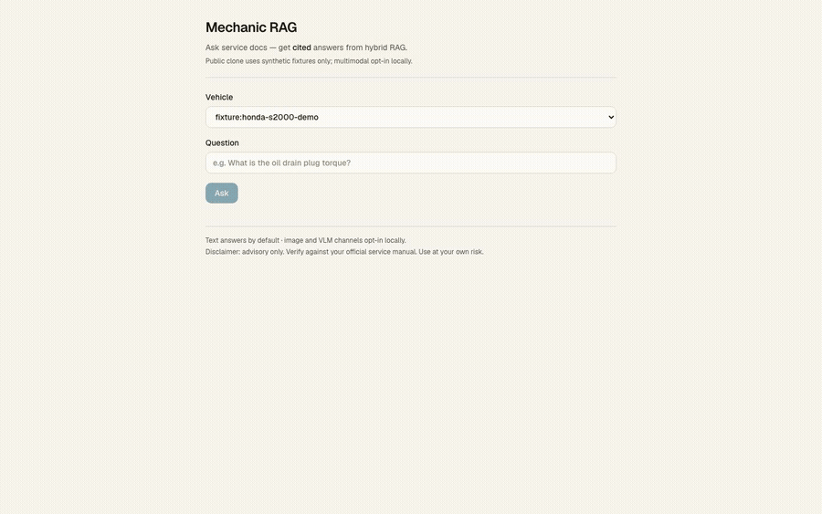
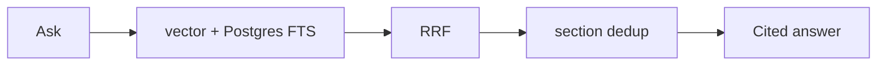

# Mechanic RAG

[](https://github.com/Alpha-W0lf/mechanic_rag/actions/workflows/ci.yml)
[](https://github.com/Alpha-W0lf/mechanic_rag/actions/workflows/ci.yml)

Cited answers from automotive service docs. Hybrid retrieval (**vector + Postgres FTS**) → **RRF** fusion → **section dedup** → cited answer with exact document, section, and page locators.

Hosted demo answers across the complete Honda S2000 service manual, owner's manual, and wiring diagrams; stranger clone runs reproducible synthetic fixtures locally.

---

### Try hosted in 60s (zero install, no GPU / models)

The fastest path to evaluate Mechanic RAG is the live demo — no Docker, no Ollama, no model downloads.

1. Open 🔗 **[mechanic-rag.vercel.app](https://mechanic-rag.vercel.app)**.
2. Select the full S2000 manual (`cat:2003-honda-s2000`) or the synthetic demo vehicle (`fixture:honda-s2000-demo`).
3. Enter a question (e.g. `What is the front brake pad inspection procedure?` or `What fluid does the rear differential use?`) and click **Ask**.
4. Inspect the cited answer: each numbered marker `[1]`, `[2]` links directly to the verified document, section, and page number.

Or test via curl against the hosted JSON endpoint:
```bash
curl -sS -X POST "https://mechanic-rag.vercel.app/api/ask" \
  -H "content-type: application/json" \
  -d '{"vehicle_id":"fixture:honda-s2000-demo","question":"What is the oil drain plug torque?"}'
```

*(You can also verify live Ask health via `python scripts/checks/prod_ask_smoke.py` or trigger the `workflow_dispatch` Production Ask smoke probe in GitHub Actions; see [`docs/ops.md`](docs/ops.md#public-ask-monitor-evidence-jh-66--jh-486). Last public smoke check: **2026-09-24 19:48 UTC** — pass, `outcome: "answered"`, 2 citations, ~2.0s; DB keep-alive: ready).*

**Production durability.** The free-tier database paused after inactivity and took the live demo down. An external daily keep-alive now prevents that. The free-tier path was then hardened: model backoff with graceful degraded answers, a daily synthetic Ask monitor that files issues, an abuse shield, and a locked-down database API. Incident write-up: [`docs/incidents/2026-08-jh17-supabase-pause.md`](docs/incidents/2026-08-jh17-supabase-pause.md). A substantive public evidence pack (stranger curls for health, DB keep-alive, catalog, and Ask) is documented in [`docs/ops.md`](docs/ops.md#public-evidence-pack-jh-489); platform pause/delete remains an honest free-tier residual risk (no paid HA or SLO).



### Hosted demo vs local clone

The hosted demo and local clone share the same retrieval core, but run on different serving tiers. **Never confuse local clone with the hosted deployment:**

| Concern | Live hosted demo (fastest eval) | Local clone (reproduction authority) |
|---|---|---|
| Prerequisites | Web browser or `curl` | Docker Compose, Node 22, Python 3.11+, host Ollama |
| GPU / Model downloads | **None** (serverless Gemini free tier) | Ollama models: `nomic-embed-text` (~274MB) + `gemma4:e2b` (~1.6GB) |
| App | Vercel Hobby — Next.js in `web/` | `pnpm dev` in `web/` |
| Database | Supabase Free Postgres + pgvector | Compose Postgres + pgvector (host **5433**) |
| Generator | Gemini API free tier `gemma-4-26b-a4b-it` (`GEMINI_MODEL` override) | Ollama `gemma4:e2b` (fallback `qwen3.5:4b`) |
| Embeddings | `gemini-embedding-001` @ 768 | Ollama `nomic-embed-text` @ 768 |
| Ranking | Hybrid vector + lexical → RRF → section dedup | Hybrid vector + lexical → RRF → section dedup → optional local CE |
| Cross-encoder rerank | ❌ Skipped (`ce_skip_reason=hosted_ce_disabled`) | ✅ Optional MiniLM CE (n=44 delta 0, no lift claim) |
| Monitoring | External keep-alive hits `/api/health?mode=db` (DB reachable). Cited-Ask monitor is JH-41 in a private ops repo, not this repo (once daily at 12:03 PM America/Chicago). Public evidence pack + how to verify via curl / `workflow_dispatch` smoke: [`docs/ops.md`](docs/ops.md#public-ask-monitor-evidence-jh-66--jh-486) | Local `/api/health` readiness (Postgres + Ollama) |
| Vehicle catalog + manual browser | ✅ | ✅ |
| Ask → cited generated answer | ✅ (Gemini) | ✅ (Ollama, or Gemini if key set) |
| BYO corpora / private garage / multimodal (M1–M3) | Served from personal-garage S2000 Gold (`cat:2003-honda-s2000`) | ✅ (Local garage Gold + optional M1–M3) |


### The problem

Service manuals bury torque specs and procedures across sections and pages. Teams and owners still dig by hand. Hosted Mechanic RAG retrieves with **vector + Postgres FTS**, fuses candidates (**RRF**), **section-dedups**, and returns an answer with **citations** (document, section, page). Local Compose may add MiniLM CE (optional; no lift). The public clone proves the product path on synthetic fixtures — not a notebook sketch and not OEM redistribution.

AI Knowledge Base keeps **coding agents** current (RAG + MCP over AI notes). Mechanic is **product RAG over vehicle service docs** with citation-backed answers and a multi-vehicle catalog shape.

### How it works



Hosted Production (the live demo) is that path. Local Compose may add MiniLM CE after section dedup — optional, not required, **no lift claim** (n=44 delta 0).

1. Select a vehicle and ask a service question.
2. Retrieve with vehicle-filtered **vector + Postgres FTS**.
3. Fuse candidates with **RRF**, then **section dedup** (default on).
4. Return an answer with **citations** (document, section, page).
5. Local Compose only: optional MiniLM CE after dedup (degrades to RRF if CE fails). Hosted skips CE (`ce_skip_reason=hosted_ce_disabled`).

### Key engineering decisions

1. **Fixtures vs private garage split** — stranger path = `fixtures/` + fail-closed; private Gold/garage via explicit env roots; no OEM in public git.
2. **Hosted ranking = vector + Postgres FTS → RRF → section dedup** — CE is not on the live path (`hosted_ce_disabled`). Local MiniLM CE is Compose-only / optional.
3. **Eval-backed ranking honesty** — local CE kept by freeze-override; **no** earned citation-lift claim (n=44 delta 0) — depth in [`FAQ.md`](FAQ.md) / [`evals/MODEL_FREEZE_STATUS.md`](evals/MODEL_FREEZE_STATUS.md).

### Try it locally

If you want to run the stack locally rather than using the hosted demo:

- **Option A: Dev Container (`.devcontainer/`)** — Instant VS Code or GitHub Codespaces (Free tier) container environment with Postgres+pgvector and dependencies installed. Run Ask without downloading multi-GB local models by pointing to Gemini API or using extractive lexical verification.
- **Option B: Local clone with Docker Compose + host Ollama** — The full local reproduction authority.

```bash
./scripts/stranger_smoke.sh
# Then: pull Ollama models → cd web && pnpm install && pnpm dev → health + ask
# Example ask vehicle_id: fixture:honda-s2000-demo
```

Full clone path, footguns, and paired-ask ablation: [`GETTING_STARTED.md`](GETTING_STARTED.md).

### Stack

| Concern | Choice |
|---------|--------|
| Web | Next.js App Router (`web/`) |
| Store | Compose Postgres + pgvector (host **5433**) |
| CLI | `mecharag ingest` / `mecharag eval` |
| Embeddings | Hosted demo: `gemini-embedding-001` @ 768 · local: Ollama `nomic-embed-text` @ 768 (frozen) |
| Generator | Hosted demo: `gemma-4-26b-a4b-it` · local: Ollama `gemma4:e2b` (fallback `qwen3.5:4b`) |
| Ranking | Hosted: vector + Postgres FTS → RRF → section dedup. Local Compose: optional MiniLM CE (no lift, n=44 delta 0) |

### Deeper docs

- [`docs/VISION.md`](docs/VISION.md) — product / why  
- [`docs/ARCHITECTURE.md`](docs/ARCHITECTURE.md) — contracts / how  
- [`docs/ops.md`](docs/ops.md) — CI gates (what a green run proves) + Ask monitor policy (pass / degraded pass / fail) + public evidence pack / stranger verify (JH-66 / JH-48.6 / JH-48.9). Cited-Ask monitor lives in a private ops repo (JH-41), not here (once daily at 12:03 PM America/Chicago).  
- [`docs/incidents/2026-08-jh17-supabase-pause.md`](docs/incidents/2026-08-jh17-supabase-pause.md) — JH-17 pause and what landed after  
- [`GETTING_STARTED.md`](GETTING_STARTED.md) — operator path  
- [`FAQ.md`](FAQ.md) — Technical FAQ  
- [`evals/MODEL_FREEZE_STATUS.md`](evals/MODEL_FREEZE_STATUS.md) — freeze honesty (override ≠ lift)  
- [`LICENSE`](LICENSE) — PolyForm Noncommercial 1.0.0 (source-available / non-commercial; not OSI open source)

Building citation-backed document RAG for a real domain? Reach me on [LinkedIn](https://www.linkedin.com/in/tchacko1/).

---

Advisory only. Verify against your official service manual. Use at your own risk. No redistribution of OEM PDFs.
