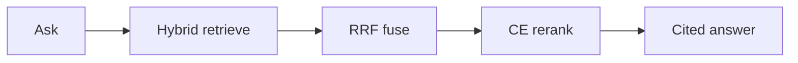

# Mechanic RAG

Cited answers from automotive service docs — hybrid RAG (vector + lexical → RRF → cross-encoder).

Public clone uses synthetic Honda S2000 fixtures; personal garage stays local.

🔗 **Live demo:** [mechanic-rag.vercel.app](https://mechanic-rag.vercel.app) — pick the fixture vehicle and ask a service question; answers cite document, section, and page.

**Production durability.** The 2026 hosted-demo outage (JH-17) was a Supabase Free auto-pause after inactivity: the Next.js shell stayed up and every Postgres path failed. JH-29 added an external keep-alive (Cloudflare Worker plus GitHub Actions) against `GET /api/health?mode=db` so a `SELECT 1` counts as store activity. Phase 7 then hardened the free-tier path: a free-tier Gemini model with backoff (JH-36/39), a public error taxonomy with HTTP 200 degraded answers when generate/embed fail after retries (JH-46), a small per-isolate Postgres pool (JH-37), a daily synthetic Ask monitor in a private ops repo that opens GitHub issues on fail (JH-41 — no public link), a per-hashed-IP and global Ask abuse shield (JH-42), and a Supabase Data API lock so PostgREST `anon` cannot read public tables (JH-52). A green keep-alive proves the DB is reachable after idle, not that Ask returned citations; scoring is in [`docs/ops.md`](docs/ops.md). Incident write-up: [`docs/incidents/2026-08-jh17-supabase-pause.md`](docs/incidents/2026-08-jh17-supabase-pause.md).


### What runs where

Topology detail: [`docs/ARCHITECTURE.md` §3.1 Production topology](docs/ARCHITECTURE.md#31-production-topology-hosted-demo). **Local Docker Compose + Ollama remains the clone/reproduction authority.**

| Concern | Live demo | Local clone |
|---|---|---|
| App | Vercel Hobby — Next.js in `web/` | `pnpm dev` in `web/` |
| Database | Supabase Free Postgres + pgvector | Compose Postgres + pgvector (host **5433**) |
| Generator | Gemini API free tier `gemma-4-26b-a4b-it` (`GEMINI_MODEL` override) | Ollama `gemma4:e2b` (fallback `qwen3.5:4b`) |
| Embeddings | `gemini-embedding-001` @ 768 | Ollama `nomic-embed-text` @ 768 |
| Ranking | Hybrid → RRF → section dedup (no CE) | Hybrid → RRF → section dedup → local CE |
| Cross-encoder rerank | ❌ `ce_skip_reason=hosted_ce_disabled` | ✅ |
| Monitoring | External keep-alive hits `/api/health?mode=db` (DB reachable). Daily Ask monitor (JH-41, private ops repo) scores cited Ask — [`docs/ops.md`](docs/ops.md) | Local `/api/health` readiness (Postgres + Ollama) |
| Vehicle catalog + manual browser | ✅ | ✅ |
| Ask → cited generated answer | ✅ (Gemini) | ✅ (Ollama, or Gemini if key set) |
| BYO corpora / private garage / multimodal (M1–M3) | ❌ | ✅ |


### The problem

Service manuals bury torque specs and procedures across sections and pages. Teams and owners still dig by hand. Mechanic RAG retrieves with **hybrid search**, fuses candidates (**RRF**), optionally reranks (**cross-encoder**), and returns an answer with **citations** (document, section, page). The public clone proves the product path on synthetic fixtures — not a notebook sketch and not OEM redistribution.

AI Knowledge Base keeps **coding agents** current (RAG + MCP over AI notes). Mechanic is **product RAG over vehicle service docs** with citation-backed answers and a multi-vehicle catalog shape.

### How it works



1. Select a vehicle and ask a service question.
2. Retrieve with vehicle-filtered **vector + lexical** search.
3. Fuse candidates with **RRF**, then **section dedup** (default on).
4. Optionally **cross-encoder** rerank (degrades to RRF if CE fails).
5. Return an answer with **citations** (document, section, page).

### Key engineering decisions

1. **Fixtures vs private garage split** — stranger path = `fixtures/` + fail-closed; private Gold/garage via explicit env roots; no OEM in public git.
2. **Hybrid → RRF → section dedup → CE with degrade** — spine stays useful if CE fails.
3. **Eval-backed ranking honesty** — CE kept by freeze-override; **no** earned citation-lift claim (n=44 delta 0) — depth in [`FAQ.md`](FAQ.md) / [`evals/MODEL_FREEZE_STATUS.md`](evals/MODEL_FREEZE_STATUS.md).

### Try it

```bash
./scripts/stranger_smoke.sh
# Then: pull Ollama models → cd web && pnpm install && pnpm dev → health + ask
# Example ask vehicle_id: fixture:honda-s2000-demo
```

Full clone path, footguns, and paired-ask ablation: [`GETTING_STARTED.md`](GETTING_STARTED.md).

### Stack

| Concern | Choice |
|---------|--------|
| Web | Next.js App Router (`web/`) |
| Store | Compose Postgres + pgvector (host **5433**) |
| CLI | `mecharag ingest` / `mecharag eval` |
| Embeddings | Hosted demo: `gemini-embedding-001` @ 768 · local: Ollama `nomic-embed-text` @ 768 (frozen) |
| Generator | Hosted demo: `gemma-4-26b-a4b-it` · local: Ollama `gemma4:e2b` (fallback `qwen3.5:4b`) |
| Ranking | Hybrid → RRF → section dedup → local CE (degrade on failure) |

### Deeper docs

- [`docs/VISION.md`](docs/VISION.md) — product / why  
- [`docs/ARCHITECTURE.md`](docs/ARCHITECTURE.md) — contracts / how  
- [`docs/ops.md`](docs/ops.md) — CI gates + Ask monitor policy (pass / degraded pass / fail). JH-41 daily Ask monitor lives in a private ops repo, not here.  
- [`docs/incidents/2026-08-jh17-supabase-pause.md`](docs/incidents/2026-08-jh17-supabase-pause.md) — JH-17 pause and what landed after  
- [`GETTING_STARTED.md`](GETTING_STARTED.md) — operator path  
- [`FAQ.md`](FAQ.md) — Technical FAQ  
- [`evals/MODEL_FREEZE_STATUS.md`](evals/MODEL_FREEZE_STATUS.md) — freeze honesty (override ≠ lift)  
- [`LICENSE`](LICENSE) — PolyForm Noncommercial 1.0.0 (source-available / non-commercial; not OSI open source)

Building citation-backed document RAG for a real domain? Reach me on [LinkedIn](https://www.linkedin.com/in/tchacko1/).

---

Advisory only. Verify against your official service manual. Use at your own risk. No redistribution of OEM PDFs.
