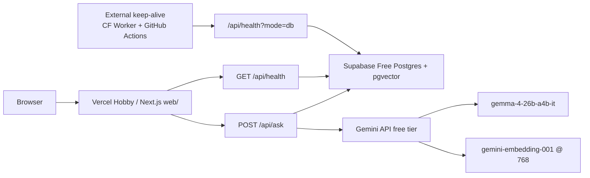

# Mechanic RAG — Architecture

**Status:** Binding technical contract for this repository — components, data contracts, ranking pipeline, corpus boundaries, and failure behavior. The vertical slice described here is implemented and running, both on the hosted demo and in the local clone. Not yet true: an independently-measured cross-encoder lift over RRF-only ranking, a second private corpus beyond the S2000, or an OSI-licensed release (license is PolyForm Noncommercial — source-available, non-commercial).
**Created:** 2026-07-12 · **Last updated:** 2026-09-24

**Related:** [`VISION.md`](./VISION.md) (product rationale) · [`../evals/MODEL_FREEZE_STATUS.md`](../evals/MODEL_FREEZE_STATUS.md) (why the embedding/reranker models are locked despite a flat measured delta)

This document is the source of truth for v1's components, data contracts, ranking, corpus boundaries, and failure behavior. It does not authorize public redistribution beyond fixtures, or claims of completeness beyond what's documented here.

**Non-authoritative for v1:** `docs/dev_setup.md`, `docs/manual_build_steps.md`, `db/schema.sql`, and early multimodal research notes — historical working notes, not current contracts. The live product path is `web/src/app/api/ask` + `web/src/server/ask.ts`; the HTTP shape is also mirrored in [`api_contracts.md`](./api_contracts.md) (derived from that code; this document remains the source of truth). The retired `supabase-js` client/schema tree under `supabase/**` has been removed; the hosted demo uses `pg` + `DATABASE_URL` directly.

---

## 1. Purpose

Mechanic RAG is a public, product-shaped RAG system over automotive service documentation: hybrid retrieval, citation-backed answers, an eval harness, and clone-and-run fixtures — built for a growing multi-vehicle library, not a single-manual demo.

| Audience | GitHub reviewers / interviewers |
|----------|--------------------------------|
| Public corpus | Synthetic / redistributable fixtures only |
| Private corpus | Local Gold RAG artifacts (outside git) |
| Not this product | Commercial shop tool, VIN lookup, a general document-capture pipeline |

---

## 2. Stack (local clone / reproduction authority)

This is the clone-and-run stack — what anyone cloning the repo actually runs. It differs from the hosted demo's production stack; see §3.1 for that.

| Concern | Choice |
|---------|--------|
| Web app | Next.js App Router under `web/src/app` |
| Offline ingest | Python CLI (`mecharag` package); not a web service |
| Database (clone) | Local Compose Postgres + pgvector on host port 5433 |
| Generator (clone) | Host Ollama; default `gemma4:e2b`, fallback `qwen3.5:4b` |
| Embeddings (clone) | Ollama `nomic-embed-text` @ 768 (frozen; hosted serving uses Gemini instead — §3.1) |
| Lexical search | Postgres generated `tsvector` + GIN index, `simple` config |
| Ranking (clone) | Vector + lexical → RRF → optional section dedup → local cross-encoder (N→K); degrades to RRF-only on CE failure. Hosted skips the cross-encoder entirely — §3.1 / §7.5 |
| Modality (v1) | Text-only; multimodal hooks reserved, not implemented |
| Vehicle identity | Year + make + model + engine (+ nullable trim). Not VIN-centric |
| Public corpus | Fixtures only; fail-closed in CI |
| Private corpus | Local Gold root; delivered by hand, never synced automatically |
| Cloud DB / hosted demo | Production (Vercel + Supabase, §3.1) is a deliberate exception to the clone policy above, made specifically to run a public demo cheaply. The local clone stays fully reproducible on Compose + Ollama alone, with no cloud dependency. |

---

## 3. Runtime overview

Local clone / reproduction authority (Compose + Ollama + local cross-encoder):

```text
Public fixtures/  OR  private local Gold root (config; never both as default)
        │
        ▼
 FixtureSource | PrivateGoldSource
        │  (one versioned NormalizedDocumentManifest interface)
        ▼
 validate → text chunk → embed → transactional upsert
        │
        └──── offline Python ingest CLI ────┘
                          │
                          ▼
             Compose Postgres + pgvector
                          ▲
                          │ vehicle-filtered vector + FTS
 Browser → Next (web/src/app)
              → ask service (web/src/server)
              → vehicle-filtered vector + FTS
              → RRF (+ optional section dedup)
              → local cross-encoder (N→K; degrade → RRF order)
              → Ollama (host)
              → server-derived citations
```

**Exactly two executable product processes in v1:**

1. Offline Python ingest CLI — adapters, validation, chunking, embedding, upsert.
2. Next.js web/API — ask orchestration, retrieval, generation, citations, health.

**Integration boundary:** Postgres. No FastAPI, queues, a second vector store, Kafka, or Drive/Google API clients in v1.

**Host Ollama (clone path)** handles generation (and embeddings if selected). A local clone never requires a cloud LLM or cloud database. The hosted demo does — Gemini API + Supabase Free — see §3.1.

### 3.1 Production topology (hosted demo)

Public demo: [https://mechanic-rag.vercel.app](https://mechanic-rag.vercel.app). This is a free-tier showcase, not an SLO-backed service. The local Compose + Ollama path above remains the clone/reproduction authority.

**Production durability.** The hosted demo went down in 2026 when Supabase Free auto-paused the database after inactivity — the Next.js shell stayed up while every Postgres-backed path failed silently. The fix was an external keep-alive (a Cloudflare Worker plus a scheduled GitHub Action) that hits `GET /api/health?mode=db` regularly, so a `SELECT 1` counts as store activity and the database never goes fully idle. The free-tier path was then hardened further: a free-tier Gemini model with retry/backoff, an HTTP 200 degraded-answer path when generation or embedding fails after retries (rather than a hard failure), a small per-isolate Postgres connection pool sized for serverless, a daily synthetic Ask monitor (running from a private ops repo, not this one) that opens a deduplicated GitHub issue on failure or degradation, a per-IP and global rate limit on the Ask endpoint, and a locked-down Postgres API so the public REST layer can't read the demo tables directly. A green keep-alive proves the database is reachable after idle — it does not by itself prove Ask returns citations; that's scored separately (see [`docs/ops.md`](./ops.md)). Full incident write-up: [`docs/incidents/2026-08-supabase-pause.md`](./incidents/2026-08-supabase-pause.md).

**What actually runs**

| Layer | Production (hosted demo) | Local clone (reproduction) |
|-------|--------------------------|----------------------------|
| App | Vercel Hobby — Next.js App Router in `web/` | `pnpm dev` in `web/` |
| Database | Supabase Free Postgres + pgvector via `DATABASE_URL` | Compose Postgres + pgvector, host port 5433 (`docker-compose.yml`) |
| Generator | Gemini API free tier, default `gemma-4-26b-a4b-it`. Overridable via `GEMINI_MODEL` (full replace; no automatic second-model failover) | Ollama `gemma4:e2b` (operator fallback `qwen3.5:4b`) |
| Embeddings | `gemini-embedding-001` @ 768 (`EMBEDDING_MODEL_GEMINI` / `EMBEDDING_DIM`) | Ollama `nomic-embed-text` @ 768 (frozen) |
| Ranking | Hybrid vector + lexical → RRF → section dedup → top-K. Never imports the local cross-encoder runtime; this is a deliberate skip, not a degraded fallback | Same retrieve/fuse, then local cross-encoder (N→K); degrades to RRF on CE failure |
| Postgres pool (hosted) | `max` 2, idle 5s, SSL, Vercel-managed pool attachment | Unchanged: `max` 10, idle 30s, no SSL, no Vercel attachment |
| Gemini 429/503 handling | Exponential backoff + jitter, max 4 attempts, then fail | n/a (Ollama path) |
| Public Ask errors | `error_class`: `generator_unavailable` \| `embedding_unavailable` \| `database_unavailable` \| `rate_limited` \| `internal`. HTTP 200 `outcome: "degraded"` when generation/embedding fails after retries and at least one citation exists; database failures stay non-200 | Same taxonomy; local generation failures stay non-200, local embedding failures may fall back to an extractive/degraded answer |
| Ask abuse shield | Per-hashed-IP 10/min + 100/day and a global 800/day cap in Postgres. Excess is HTTP 429 with `Retry-After`. Fails open (does not block traffic) if the limiter table is missing or the query fails | Same code against local Postgres; disable with `ASK_RATE_LIMIT_DISABLED=1` |
| Data API lock | Row-level security enabled and `anon`/`authenticated` revoked on public tables and sequences, so the auto-generated Postgres REST API can't read the demo corpus directly. The app itself never uses that REST layer — it connects as `pg` + `DATABASE_URL`, so this lock changes nothing about how Ask or ingest actually work | Same migration applies; the revoke is a no-op locally since those roles don't exist |
| Keep-alive | External Cloudflare Worker + scheduled GitHub Action hit `GET /api/health?mode=db`. An in-repo weekly Action was removed once the external one existed, so this dormant repo wouldn't lose its own GitHub Actions schedules to inactivity | Local curl of the same endpoint |



**Hosted ranking, honestly.** Before this was made deliberate, the hosted path attempted to dynamically import the cross-encoder runtime and then degraded, because that import doesn't succeed on Vercel Hobby — so reviewers were already seeing RRF + section-dedup ranking on Production either way. The only change was making that skip an explicit, logged decision (`ce_skip_reason=hosted_ce_disabled`) instead of a silent failure path. The ranking output is identical; only the mechanism became intentional. Local clone still reranks with the cross-encoder.

**Keep-alive: what it proves vs. what it does not.**

| Probe | Proves | Does **not** prove |
|-------|--------|-------------------|
| External keep-alive → `GET /api/health?mode=db` | Hosted function can open Postgres (`SELECT 1`); database reachable after idle | Gemini generation works, Ask returns an answer, or citations are present |
| Default `GET /api/health` on hosted (with `GEMINI_API_KEY` set) | Postgres is up; the Gemini path is treated as ready because the key is present — there's no live ping to Gemini | That Ask actually answers with citations |
| Daily synthetic Ask monitor (runs from a private ops repo, not this one) | Hosted Ask, scored per [`ops.md`](./ops.md); opens a deduplicated GitHub issue on failure or degradation. Not implemented in this repository. Public evidence pack and how to verify it yourself: [`ops.md`](./ops.md) | In-repo CI. The keep-alive's `SELECT 1` |

A green keep-alive is a pause/wake, DB-reachable signal — it is not a cited-Ask monitor. This document intentionally omits project references, pooler hostnames, or keys.

---

## 4. Repository layout

| Path | Role |
|------|------|
| `web/src/app/` | Canonical pages + HTTP route handlers (`/api/ask`, `/api/health`, UI) |
| `web/src/server/` | Server-only ask orchestration, DB repos, retrievers, cross-encoder adapter, Ollama adapter, citation assembly |
| `web/src/lib/retrieval/` | Pure ranking/fusion/dedup types and algorithms (RRF, section dedup); no DB, Next.js, or model-runtime imports |
| `scripts/ingest/` + Python package | Offline CLI: sources, validation, chunking, embedding, upsert |
| `contracts/` | Versioned Gold/fixture manifest schema + public API schemas |
| `db/migrations/` | Sole schema authority (Compose init/migrate applies these) |
| `fixtures/` | Synthetic/redistributable manifests + text only |
| `evals/` | Versioned fixture cases + harness inputs (no private corpus) |
| `docker-compose.yml` | Postgres + pgvector only |

The app tree is `web/src/app` only — an earlier, now-removed root `web/app/` tree is not recreated; Next.js ignores `src/app` when a root `app/` exists, so keeping both would silently break routing.

**Stale, not extended:** `db/schema.sql`, early Gemini multimodal research notes, and a historical, non-product ingest script (`scripts/ingest/parse.py`). The retired `supabase-js` ingest/deploy scripts and the `supabase/**` tree were removed; the hosted demo talks to Postgres directly via `pg` + `DATABASE_URL`.

---

## 5. Corpus boundary (binding)

### 5.1 Delivery vs. ingest

| Rule | Binding |
|------|---------|
| Human delivery only | A private document-delivery channel (e.g. a shared drive) is a human handoff endpoint only — never something this service reads from directly. |
| Private ingest reads locally | Private ingest reads a configured local Gold root — never a remote delivery channel. |
| One-way publish | Publishing processed output back out is an explicit, one-way operator action. Never a two-way sync, and never something this service initiates automatically. |
| Backup is out of scope | Backing up source/catalog data is a library/ops concern, not a Mechanic runtime dependency. |

Mechanic must not implement OAuth, listing, download, or upload clients for any third-party file-delivery service — that integration surface is intentionally out of scope.

### 5.2 Adapters

One versioned `NormalizedDocumentManifest` interface, two adapters:

| Adapter | Input | Trust |
|---------|-------|-------|
| `FixtureSource` | Allowlisted paths under `fixtures/` only | Public-safe; CI and release checks reject PDFs, private roots, private-only manifest classes, and anything outside the allowlist |
| `PrivateGoldSource` | A configured local Gold root via `MECHANIC_PRIVATE_GOLD_ROOT` / `--root` (outside the default `fixtures/` path) | Supports both synthetic multi-vehicle fixtures and a real ingest pilot: a status file maps to a normalized manifest (`mecharag receipt-to-gold-status`), then ingests through the same pipeline as any other source. Piloted end-to-end with a second vehicle (a 2017 F-150) as a synthetic test case (`cat:2017-f-150`, `cat:demo-synthetic-f150`) proving the adapter mechanism itself works. An incomplete Gold set correctly yields `insufficient_evidence` rather than a fabricated answer — this pilot is not the same thing as a completed, production-scale ingest of that vehicle's real corpus. |

Downstream chunk/embed/upsert code is shared between both adapters. There is deliberately no single adapter with a "trust mode" flag that could point a public default at a private root — that would be a real safety hazard, so the two paths are structurally separate instead.

### 5.3 Fail-closed policy and the hosted exception

Public clone/CI/release checks fail closed if:

- OEM or private PDFs, or extracted OEM text, appear in tracked paths
- Private Gold roots or credentials appear in default config or fixtures
- A manifest's class is not on the public allowlist

Private local ingest deliberately does not enforce a legal/rights gate — that's a judgment call made by whoever runs the private ingest, not something this codebase can verify. The two worlds (public git, private local ingest) never share roots, credentials, or default config.

**Git clone vs. hosted Production (deliberate split, since 2026-09-24):**
- **Git clone / CI / strangers:** the public corpus stays fixtures-only (`fixtures/honda_s2000_demo`) forever. `scripts/checks/public_fail_closed.py` and CI run against fixtures unchanged, and reject private-only manifest classes, raw PDFs, and non-fixture vehicle IDs in the git repository.
- **Production hosted database (Supabase):** may hold owner-accepted private text and embeddings for the real 2003 Honda S2000 service manual, owner's manual, and wiring diagrams — text and embeddings only, never raw PDFs or page images.
- **Ingest boundary:** production ingest runs out-of-band, from the operator's own machine. No private source material, PDFs, or credentials are ever committed to this repository.

### 5.4 Gold granularity

| Layer | Owns |
|-------|------|
| Upstream document processing | Parses and normalizes source material into validated page/section text with lineage |
| Mechanic | Retrieval chunking, embedding, index state |
| Shared catalog (when present) | Canonical `vehicle_id` issuance |

Mechanic v1 consumes text-first Gold/fixtures, not raw PDFs. Fixtures use a reserved `fixture:` `vehicle_id` prefix; catalog-issued private IDs use `cat:`. Both share the same identity fields (year/make/model/engine, optional trim) — no VIN keys.

The manifest schema is code, not just documentation: `mechanic_rag/contracts/normalized_document_manifest.schema.json`, with a field inventory and a validator at `scripts/validate/validate_manifest.py`.

---

## 6. Relational model

`db/migrations/` is the only schema authority. An earlier `db/schema.sql` from the Supabase-client era is obsolete.

### 6.1 `vehicles`

| Field | Notes |
|-------|-------|
| `vehicle_id` | Stable text primary key; `fixture:` (public) or `cat:` (catalog-issued private) |
| `year`, `make`, `model`, `engine` | Required identity |
| `trim` | Nullable |
| — | No VIN column as an identity key; VIN may appear later only as optional instance metadata, never as the catalog key |

### 6.2 `documents`

| Field | Notes |
|-------|-------|
| Stable document + version identity | Same logical document across versions (`document_id` + `artifact_version`) |
| `vehicle_id` | Foreign key |
| `doc_family` | `service_manual` \| `wiring` \| `connectors` \| … |
| Source / provenance | Upstream adapter/source IDs, a redacted locator, and export IDs where available |
| `content_hash` | For idempotent skip on re-ingest |
| `artifact_version` | Gold/fixture version |
| `corpus_version` | From the upstream Gold manifest; a bump marks affected rows `reindex_needed` |
| Page/section metadata | `page_start`/`page_end`, `section_path`, heading — enough for a citation locator before chunking |

Uniqueness is per vehicle × family × source/version, not a single global unique document name.

### 6.3 `chunks`

| Field | Notes |
|-------|-------|
| Stable `chunk_id` | Shared by the vector retriever, lexical retriever, RRF, cross-encoder, and citations — the reranker never invents new IDs |
| Document/version foreign key | |
| `vehicle_id`, `doc_family` | Denormalized or join-enforced for query filters |
| Page/section locator | `page_start`/`page_end`, `section_path`, heading |
| `content` + content checksum | |
| `modality` | `'text'` in v1 |
| `embedding` | Fixed dimension matching the locked embedding model |
| Lexical | Generated `tsvector` (`simple` config) + GIN index |
| Embedding model/version | Stored for compatibility checks on schema or model changes |

Vector index: HNSW or IVFFlat over the fixed-dimension column only — never an unbounded `vector` column with a non-expression IVFFlat index.

### 6.4 `index_state`

Owned entirely by Mechanic:

- Keyed by `vehicle_id` × `doc_family` (and index/embedding/chunker versions as needed)
- Status: `not_indexed` \| `indexed` \| `reindex_needed` \| `blocked`
- Does not store upstream capture or delivery state — that stays in the upstream document-processing system
- The cross-encoder is query-time only — its version is logged per-ask, never used as an `index_state` key

### 6.5 Ingest transactions

1. Validate the full manifest before any writes.
2. Upsert one document version atomically.
3. Unchanged `content_hash` → skip.
4. A failed new version leaves the prior indexed version queryable.
5. An embedding/chunker/schema version change marks the affected vehicle × family `reindex_needed` and rejects incompatible vectors at ingest.

---

## 7. Ranking contract (binding)

This is the actual product surface — the RAG ranking pipeline Mechanic exists to demonstrate. Implement exactly this order; no parallel scorers.

**Pipeline (binding order):**

```text
vehicle-filtered vector + lexical (independent, topN each)
        → RRF fuse (stable chunk_id)
        → optional section dedup
        → take top N → local cross-encoder → top K
        → context assembly + citation labels
```

Provisional sizes (defaults, tuned only with eval evidence — no stage is left optional or reordered):

| Symbol | Meaning | Provisional default |
|--------|---------|---------------------|
| `topN` | Cap per independent retriever (vector / lexical) | 50 |
| `N` | Cross-encoder shortlist size after RRF (+ optional dedup) | 20 |
| `K` | Final chunks after the cross-encoder, for context assembly | 8 |

### 7.1 Retrieve independently

1. Every ask requires a canonical `vehicle_id` — no all-vehicle fallback, no VIN lookup.
2. Optionally filter by `doc_family` when the API supplies it.
3. Run vector ANN search and lexical full-text search as independent queries against Postgres.
4. Both result lists use the same stable `chunk_id` values for the same underlying rows.
5. Cap each list at `topN` (provisional default 50).

**Lexical search** uses Postgres `to_tsvector('simple', …)` / `plainto_tsquery('simple', …)` plus a GIN index — not a separate search service like OpenSearch or Elasticsearch. Trigram or exact-match supplementation is a future option only if fixture evals show systematic misses; it's not in v1's day-one scope.

### 7.2 Fuse with Reciprocal Rank Fusion (RRF)

- Pure reciprocal-rank fusion over the two rank lists: `rrf_score(id) += 1 / (k + rank)`, with a default `k = 60`.
- RRF scores are rank-derived sums, not a normalized `[0,1]` similarity score — types and docs must not claim otherwise.
- `web/src/lib/retrieval/rrf.ts` is the implementation, valid once chunk IDs are stable across both retrievers.

### 7.3 Section deduplication

- An optional pass, after RRF and before the cross-encoder, drops or demotes near-duplicate chunks that share the same document and section path — a deterministic diversification step.
- Binding order with the cross-encoder: RRF → optional section dedup → cross-encoder. No second, competing dedup pass runs after the cross-encoder.
- The implementation, `web/src/lib/retrieval/section_dedup.ts`, is a binary same-section penalty — deliberately **not** true MMR (it has no candidate-to-candidate embedding similarity comparison). It's not described as MMR anywhere in this codebase for exactly that reason; it earns the name "MMR" only if a real embedding-similarity version is built and evals justify it.

### 7.4 Cross-encoder rerank

1. Take the top `N` fused (+ optionally deduped) chunk IDs — the cross-encoder only ever operates on IDs already present in the fused list; it never invents rows.
2. Load chunk text from the database for those IDs; score `(query, chunk_text)` pairs with a local cross-encoder.
3. Sort by `ce_score`; keep the top `K` for context assembly.
4. **Score-domain honesty:** RRF and cross-encoder scores are never conflated under one ambiguous `score` field — types, diagnostics, and logs use distinct names (`rrf_score`, `ce_score`), and neither is treated as `[0,1]`-normalized unless a specific model documents that scale.
5. **Module boundary:** cross-encoder model loading/inference lives in the `web/src/server/` adapter layer. `web/src/lib/retrieval/` stays free of any model-runtime import — pure fusion/dedup logic only.
6. A local cross-encoder is used deliberately, for privacy and to avoid a hosted-reranker dependency — a hosted reranker used as a silent default, without a defined N/K, a degrade path, and eval evidence, would not meet this project's bar. The exact frozen model and runtime for the current portfolio claim are recorded in `evals/MODEL_FREEZE_STATUS.md`.
7. The cross-encoder call is timeout-bounded, and a small `K` keeps the added latency acceptable; this latency-for-quality tradeoff versus RRF-only is an accepted design choice, not an oversight.

### 7.5 Degrade to RRF-only

If the reranker fails, fail open to the fused (+ optionally deduped) order — an ask never fails solely because the cross-encoder failed, and the system never fabricates an answer to compensate.

| Case | Required behavior |
|------|-------------------|
| Cross-encoder unavailable or fails to initialize | Serve top-K from the post-RRF (+ dedup) list; mark `rerank_degraded=true` |
| Cross-encoder timeout | Same degrade; never block the ask indefinitely |
| Cross-encoder returns empty or all-invalid IDs | Same degrade; never invent chunks |
| Hosted Gemini serving path | Never imports the cross-encoder runtime at all; serves top-K from post-RRF (+ dedup) with `ce_skip_reason=hosted_ce_disabled` — an intentional skip, distinct from both `rerank_degraded` and an ablation run. The hosted path never successfully ran the cross-encoder before this was made deliberate (the runtime failed to load on Vercel); the ranking output is unchanged, only the mechanism became explicit. |
| Cross-encoder succeeds | Use cross-encoder order for the context top-K |

`rerank_degraded` appears in structured ask logs, and in the API's `diagnostics` field when a development flag is enabled. A degrade skips the cross-encoder only — citation validation and the insufficient-evidence rule still apply in full.

### 7.6 Context assembly

1. Take the top `K` chunks (cross-encoder order, or RRF order if degraded) within a bounded token/character budget.
2. Assign server-side citation labels (`[1]`, `[2]`, …) exactly once, at assembly time — this is the only place labels are assigned, sequential from 1 in assembly order.
3. Pass only labeled context to the generator (local Ollama or hosted Gemini).
4. After generation, the returned `citations` array is the referenced subset of that assembled list — labels stay stable even if the array is sparse (e.g. an answer citing `[1]` and `[3]` returns exactly those two labels, still pointing at their original chunks). Labels are never renumbered unless the answer text itself is rewritten in the same step; renumbering only one side would misattribute a citation to the wrong source. If the answer contains no markers at all, the full assembled list is returned.
5. Unknown markers (e.g. `[99]`, or `[3]` when only two chunks were assembled) are rejected: stripped from the answer text and never added to the citation array. Known markers are left untouched.
6. Citation metadata comes from database rows only — never from anything the model invents.
7. Extractive or degraded answers follow the same label-stability rule: skipped empty-content rows keep the original labels of whatever rows remain.
8. The UI renders `[n]` in an answer as a link to `#citation-n` only when a citation with that label is actually present in the response; otherwise the token stays plain text.

### 7.7 Model locks

| Lock | Gate |
|------|------|
| Embedding model + dimension | Locked before claiming any hybrid-retrieval eval baseline |
| Cross-encoder model + runtime | Locked before claiming any measured lift over RRF-only |

The current portfolio model choice — local `nomic-embed-text` @ 768 for embeddings, a MiniLM cross-encoder for reranking — is frozen by deliberate decision, recorded in `evals/MODEL_FREEZE_STATUS.md`, despite a paired evaluation (n=44) showing a flat delta (no measured lift). A small early proxy run had shown a promising-looking result (`ce_vs_rrf_delta_hits=+1`, n=5), but n=5 is not a sound sample size to freeze a model choice on, and it is explicitly not treated as freeze evidence here. That's stated plainly rather than implied otherwise: the freeze is about reproducibility and avoiding endless model-shopping, not a claim of a measured win. Hosted serving uses `gemini-embedding-001` @ 768 instead, chosen for dimension-compatibility with the same schema — this does not reopen the freeze, and it does not mean Production has no real database behind it (see §2 / §3.1).

---

## 8. Ask API contract

Supersedes `docs/api_contracts.md` and an earlier, retired stub route. `web/src/server/ask.ts` implements this shape.

### 8.1 `POST /api/ask`

**Request (required fields):**

```json
{
  "vehicle_id": "string",
  "question": "string"
}
```

Optional, for later: `doc_family`, a bounded `history`. An earlier `{ "query" }` request shape is retired.

**Success (200):**

```json
{
  "answer": "string",
  "citations": [
    {
      "label": "1",
      "chunk_id": "string",
      "vehicle_id": "string",
      "doc_family": "string",
      "document_id": "string",
      "section_path": "string|null",
      "page_start": "integer|null",
      "page_end": "integer|null"
    }
  ],
  "diagnostics": null
}
```

`diagnostics` (retriever counts, latencies, model/index versions) is populated only when a development flag is on — never private chunk bodies, and never in default responses or logs.

**No evidence found:** HTTP 200 with an explicit insufficient-evidence answer and empty or minimal citations — never invented mechanical advice.

**Abuse shield:** exceeding the per-client or global Ask budget returns HTTP 429 with `error_class: "rate_limited"` and `Retry-After`, before any embedding or generation call runs. This is distinct from a Gemini rate limit encountered after retrieval has already started, which degrades instead (HTTP 200).

**Dependency failure:** a down Postgres stays non-200 `database_unavailable` — the system never fabricates an answer to route around it. A Gemini generation/embedding failure after retries, with at least one citation already available, returns HTTP 200 `outcome: "degraded"` with an `error_class` (`generator_unavailable` | `embedding_unavailable` | `rate_limited`) and extractive excerpts only. Zero citations, or a local generation failure, keeps the existing non-200 `error_class`.

**Multimodal, out of the default response:** an optional local vision-model assist (`gemma4:e2b`) exists behind a flag (default off), routed only when the flag is on and either the UI requests a diagram or a heuristic triggers (torque-only questions skip it); it times out at 45s and degrades cleanly, and a filter strips any VLM-reported torque/force value not already present in the cited text — an image can never override what the text citations already own. Evidence: `evals/evidence/2026-07-27_m3_vlm_eval_evidence.json`. A separate optional image-retrieval channel exists for the private multi-vehicle garage: a side table of CLIP embeddings (`openai/clip-vit-base-patch32`, 512-d), queried via a CLIP text encoder and fused into the same RRF pipeline (`k=60`) alongside text and lexical results; an empty or degraded image list falls back identically to the text-only two-list RRF, and a diagram result always requires a paired text chunk. Neither capability is required for, or exposed in, the default public demo path.

### 8.2 Frontend

A thin consumer of the ask contract: vehicle selector, question input, answer + citations display, and empty/no-evidence and dependency-error states. No retrieval logic runs in the browser. UI polish beyond the vertical slice is lower priority than the retrieval/ranking core.

---

## 9. Health and observability

### 9.1 `GET /api/health`

| Mode | Behavior |
|------|----------|
| Liveness (`?mode=live` or `liveness`) | Process is up → `200` `{"status":"ok","mode":"liveness"}` |
| DB probe (`?mode=db`) | `SELECT 1` only. Success → `200`. Failure → `503` JSON, never an empty 500. Public JSON never includes driver or pooler text. |
| Readiness (default) | Postgres is required. Ollama is required only when `GEMINI_API_KEY` is unset (local Compose). The hosted Gemini path is considered ready once Postgres is up. Not ready → `503`; connection failures never surface as an empty 500. |

```bash
# Postgres-only keep-alive / probe (local)
curl -sS -D- "http://localhost:3000/api/health?mode=db"
# Hosted (after deploy)
curl -sS -D- "https://mechanic-rag.vercel.app/api/health?mode=db"
```

Liveness, the DB probe, and readiness are three distinct contracts — this never regresses to a single always-`{"status":"ok"}` response regardless of mode.

**Keep-alive vs. pool sizing vs. Ask — three different guarantees.** `GET /api/health?mode=db` is what the external keep-alive hits; it proves Postgres accepts a `SELECT 1` after idle (a pause/wake, DB-reachable probe) — it proves nothing about connection-pool sizing under load, and nothing about whether Gemini actually generates an answer with citations (that's the separate daily Ask monitor, scored in [`ops.md`](./ops.md)). Default hosted readiness treats Gemini as ready whenever `GEMINI_API_KEY` is set and Postgres is up — it doesn't call Gemini to check. The hosted Postgres pool is deliberately small and short-lived (a small per-isolate `max`, a 5-second idle timeout, transaction-mode pooling on port 6543) specifically so that many concurrent serverless function instances don't multiply into more connections than Supabase Free allows. A green keep-alive doesn't mean the pool is safe under load, and a healthy pool doesn't substitute for the keep-alive — they're independent guarantees, and public health JSON never includes driver, pooler, or host text either way.

**Hosted `DATABASE_URL`:** use the Transaction pooler connection string (port 6543) from Supabase's connection dialog; direct/session-mode strings (port 5432) work with the same small pool, but 6543 is preferred on Vercel. The host is never logged or committed.

### 9.2 Ask path logs (structured)

Emitted per ask: a request ID, `vehicle_id`, vector/lexical result counts and latencies, RRF result size, section-dedup drop count (if any), cross-encoder `N`/`K`, cross-encoder latency, `rerank_degraded`, the chosen `chunk_id`s, embedding/index/generator/cross-encoder versions, and the outcome. Private chunk bodies are never logged by default.

### 9.3 Ingest logs

Emitted per run: a run ID, manifest ID, content hashes, inserted/skipped/failed counts, and the final atomic status.

### 9.4 Bounds

- Question length and context size are enforced server-side.
- Database and Ollama calls are timeout-bounded, with request cancellation supported where practical.
- Optional observability integrations (LangSmith/Phoenix-style run tracing) are available but not required for the vertical slice.

---

## 10. Evaluation

| Layer | What |
|-------|------|
| Unit | Manifest validation, chunking determinism, RRF, section dedup, cross-encoder degrade path (with a fake CE), citation label mapping |
| Integration | Idempotent re-ingest, vehicle-filter isolation, against Compose Postgres |
| API | Contract tests with a fake Ollama (and a fake cross-encoder for both the degrade and success paths) |
| Eval set | A versioned fixture case set (started smaller for the initial slice, grown over time) |

**Metrics defined now (thresholds set later, once a baseline exists):**

- Retrieval: Recall@k, MRR (and/or nDCG@k) against fixture ground truth
- Citation: cited `chunk_id`/locator correctness against the allowed evidence set
- Rerank lift: a paired comparison on the same fixture cases — RRF-only (or CE-degraded) vs. RRF + cross-encoder, on both retrieval and citation metrics; degrade rate is logged across harness runs
- Generation quality is graded only after the retrieval baseline is itself honestly measured — public release is never gated on an invented answer score

The cross-encoder stays in the pipeline only if fixture evals show a real lift, or a human reviewer records an explicit, justified reason to keep it anyway — shipping a reranker with zero supporting evidence isn't acceptable here. Numeric public-release thresholds are locked only after a first honest fixture baseline exists; this document never invents pass/fail numbers ahead of that.

---

## 11. Multimodal extension (design + staged roadmap)

The public v1 path ships text-only by default. The staged roadmap is: linked visuals first, then image retrieval, then vision-assisted answers — each its own scoped milestone, not a single big-bang feature. All three stages exist today behind flags in the private multi-vehicle garage context; the public path stays text-only and honest about that.

1. Chunk/retrieval types carry a `content_modality` field on chunks (`text` now; `image`/`table` reserved for later) and a separate channel field on retriever hits (`vector` / `lexical` / `fusion`) — the two are never conflated into one key.
2. The schema reserves nullable secondary-embedding columns or separate tables; no image extraction, storage, or visual API fields are implemented in the text-only milestone.
3. Fusion stays modality-agnostic: ranked ID lists in, a ranked list out. The cross-encoder scores text pairs only in the text-only and linked-visuals stages; a genuinely multimodal cross-encoder is a later-stage concern.
4. Stable `document_id` + page locators are preferred throughout, so that text Gold data isn't discarded once visual assets do arrive.
5. Multimodal research notes remain proposals, not committed scope, until a specific stage is explicitly authorized.

---

## 12. Ownership vs. the broader vehicle library

| Concern | Owner |
|---------|--------|
| Source document capture/collection | A separate capture pipeline, outside this repo |
| Processing / normalizing / Gold build / publish | A separate library program |
| Shared catalog `vehicle_id` issuance | A catalog contract, potentially a future shared repo |
| Chunk → embed → index → ask → eval | Mechanic (this repo) |
| Public fixtures | Mechanic's own `fixtures/` |

Mechanic never queries the upstream capture/processing systems directly. It may store imported provenance or upstream artifact IDs for lineage, but never mutates any upstream system's state.

---

## 13. Failure modes and edge cases

| Case | Required behavior |
|------|-------------------|
| Missing or unknown `vehicle_id` | 4xx; no retrieval attempted |
| Empty or oversized question | 4xx |
| No hits after filters | Insufficient-evidence response |
| Ollama down or timed out | Non-200; no hallucinated answer |
| Postgres down | Non-200 readiness/ask failure |
| Ingest crash mid-write | The prior document version stays queryable |
| Re-ingest of the same content hash | Skipped; idempotent |
| Embedding dimension/model mismatch | Rejected at ingest; marked `reindex_needed` |
| A private-only manifest class or raw PDF reaches the public path | Fails closed in CI/release |
| A dual Next.js app tree | Forbidden — the root `app/` tree stays removed |
| Cross-vehicle retrieval | Forbidden without an explicit multi-select API (not in v1) |
| Cross-encoder unavailable, timed out, or returns empty scores | Degrades to RRF (+ dedup) order; sets `rerank_degraded`; citation validation still applies |

---

## 14. Explicit non-goals (v1)

- A hosted black-box reranker (e.g. a third-party reranking API) as a silent default, without a defined N/K, a degrade path, and eval evidence
- A second-stage LLM re-score used as a substitute for the local cross-encoder
- True embedding-similarity MMR, unless a later eval specifically justifies building it
- Requiring a cloud dependency to clone and run the project locally, or treating the retired `supabase-js` code path as current
- Any third-party file-delivery API client (e.g. Drive/Dropbox-style integrations)
- Bulk document capture or collection tooling inside this repository
- Raw PDF ingest as the public path
- VIN-centric identity, or a VIN-required ask
- Multimodal retrieval or `visual_assets` in the default public response
- Streaming answers, a message queue, a second web framework, or a second vector database
- A public release before the packaging checklist is actually complete
- Final numeric eval thresholds invented ahead of a real baseline
- Final embedding/cross-encoder model choices invented ahead of a fixture benchmark

---

## 15. Where this stands today

The vertical slice — hybrid retrieval, RRF fusion, section dedup, cross-encoder reranking with degrade, cited generation, and fixtures-only public packaging — is built and running, on both the local clone and the hosted demo. The private-Gold ingest path is implemented for a real vehicle corpus, with a working synthetic-to-real pilot flow. Embedding and cross-encoder model choices are frozen by deliberate decision rather than a measured win (§7.7).

Still genuinely open, stated plainly rather than implied otherwise: a fully-automated multi-vehicle onboarding flow beyond the current pilot process, true embedding-similarity MMR, a from-scratch cross-encoder lift measurement on a larger eval set, and general UI polish beyond the functional vertical slice. None of these block the current demo or its citations; they're the honest list of what "v1 complete" does not yet include.

---

## 16. Superseded decisions

An early architectural direction rejected any neural/cross-encoder reranker for v1, in favor of RRF-only ranking. That decision was overridden once a portfolio-quality bar for the ranking stage required a reranker with a defined degrade path — see §7.4.
